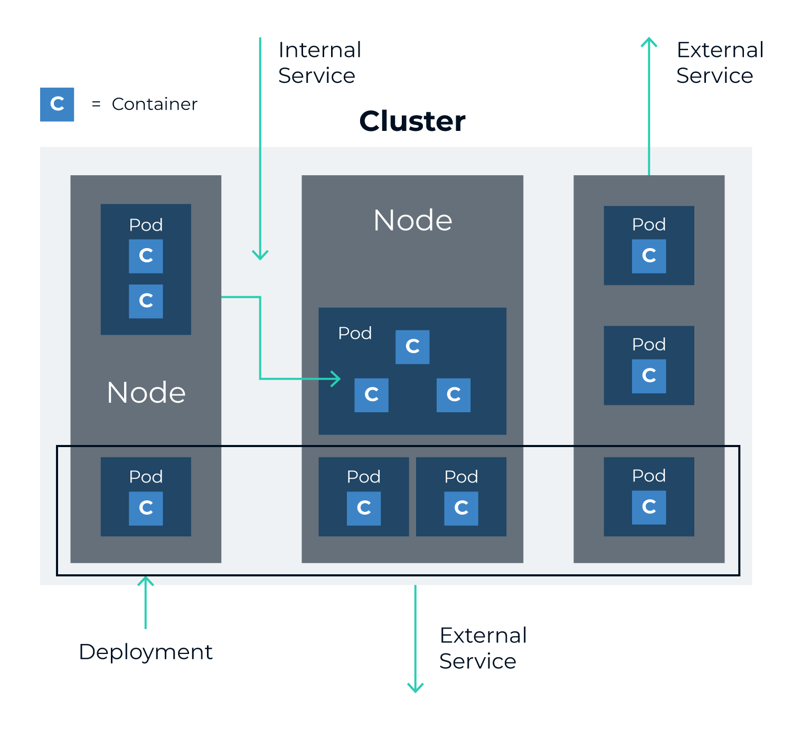
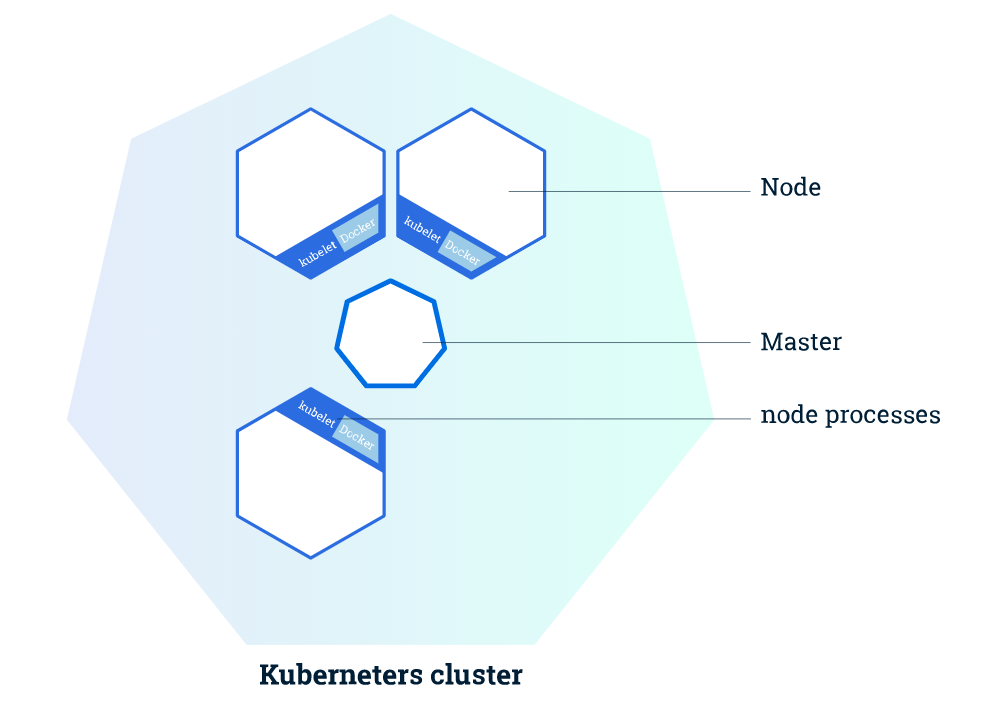
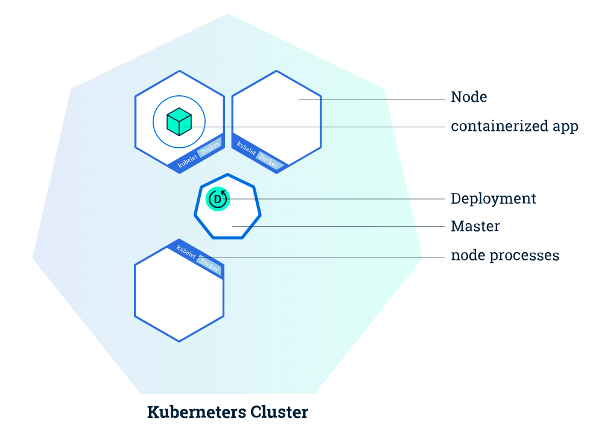
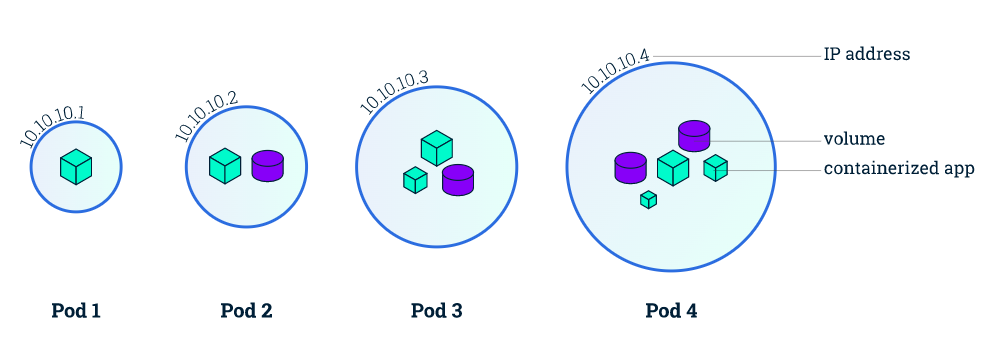
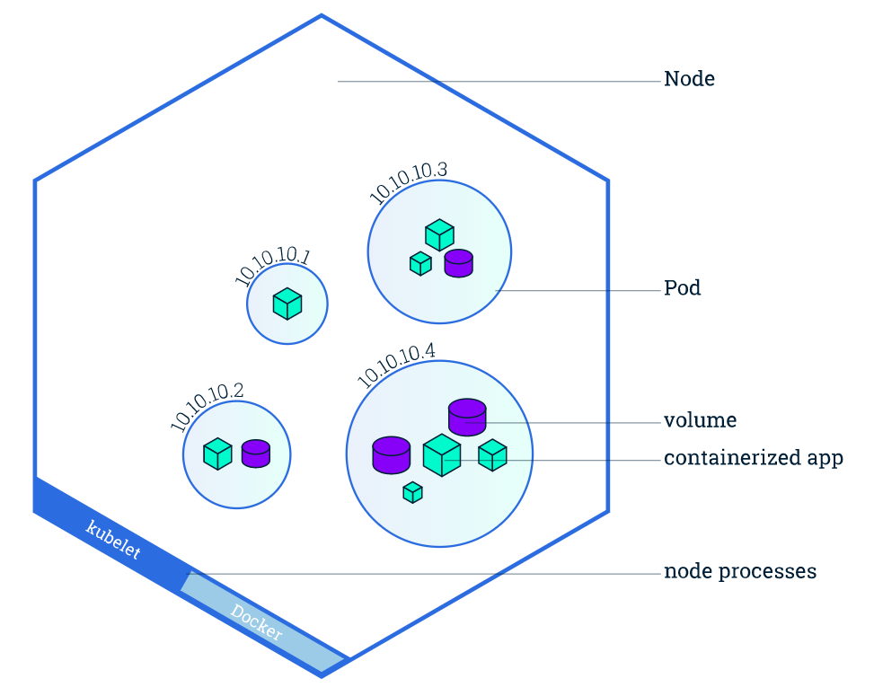
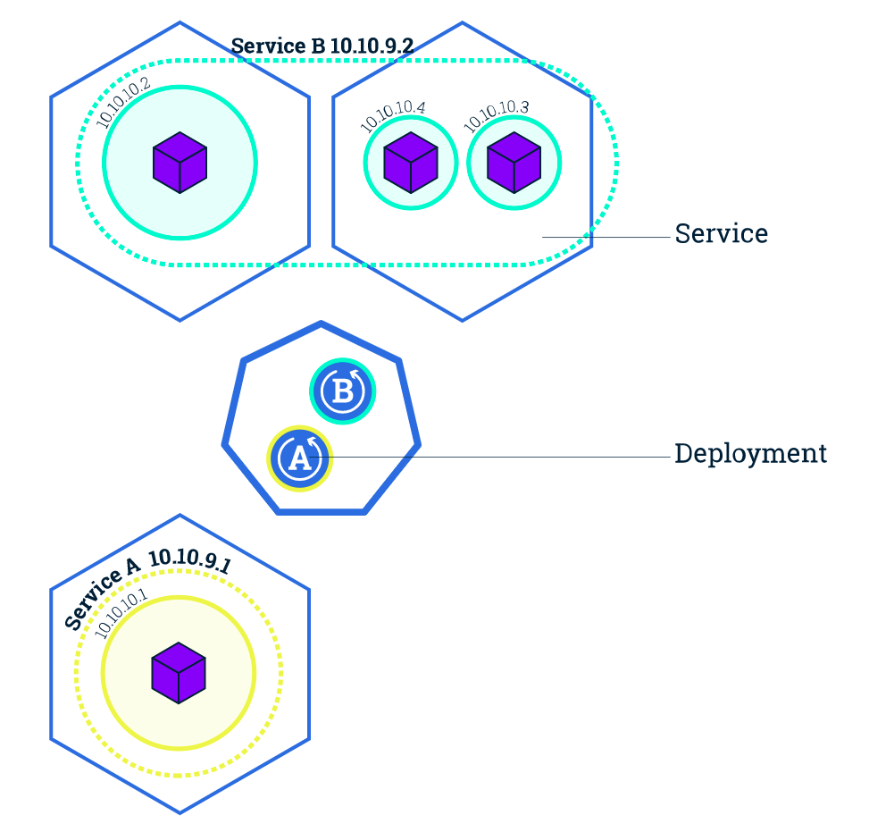

Terms with which you should be familiar:

* Cluster – Group of physical or virtual servers wherein  Kubernetes is installed. A set of worker machines, called nodes, that run containerized applications. Every cluster has at least one worker node.
* Node (Master) – Physical or virtual server that **controls** the Kubernetes cluster
* Node (Worker) – Physical or virtual servers where  **workloads run** in a given container technology 
* Pods – A pod is the **smallest unit** in a Kubernetes cluster. A pod may contain one or more containers. Group of containers and volumes which share the same network namespace 
* Labels – User defined **Key:Value pair** associated to Pods  
* Master – Control plane components which provide access  point for admins to manage cluster workloads 
* Service – An abstraction which serves as a proxy for a group of Pods performing a “service”

### Cluster

Masters manage the cluster and the nodes are used to host the running applications.

### Deployment

A Deployment is responsible for creating and updating instances of your application. 
After creating application instances, a Deployment Controller continuously watches them, and replaces an instance if the 
Node hosting it goes down or it is deleted. This provides a self-healing mechanism to address machine failure and machine maintenance.

### Pod

A Pod is a group of one or more application containers (such as Docker or rkt) and includes shared storage (volumes), 
IP address and information about how to run them. Pods always run on Nodes.

Containers should only be scheduled together in a single Pod if they are tightly coupled and need to share resources such as disk.

Kubernetes gives every pod its own cluster-private IP address, so you do not need to explicitly create links between pods or map container ports to host ports. This means that **containers within a Pod can all reach each other's ports on localhost**, and all pods in a cluster can see each other without NAT.

### Node

A node is a worker machine in Kubernetes and may be a VM or physical machine, depending on the cluster. Multiple Pods can run on one Node.

### Service

While Pods do have their own unique IP across the cluster, those IP’s are not exposed outside Kubernetes. Taking into account that over time Pods may be terminated, deleted or replaced by other Pods, we need a way to let other Pods and applications automatically discover each other. Kubernetes addresses this by grouping Pods in Services. A Kubernetes Service is an abstraction layer which defines a logical set of Pods and enables external traffic exposure, load balancing and service discovery for those Pods.

This abstraction will allow us to **expose Pods to traffic originating from outside the cluster**. Services have their own unique cluster-private IP address and expose a port to receive traffic. If you choose to expose the service outside the cluster, the options are:
* LoadBalancer - provides a public IP address (what you would typically use when you run Kubernetes on GKE or AWS)
* NodePort - exposes the Service on the same port on each Node of the cluster using NAT (available on all Kubernetes clusters, and in Minikube)

A Kubernetes Service is an abstraction layer which defines a **logical set of Pods** and enables external traffic exposure, load balancing and service discovery for those Pods.

REF: https://www.mirantis.com/blog/kubernetes-cheat-sheet/
REF: https://kubernetesbootcamp.github.io/kubernetes-bootcamp/index.html

**Desired state** is one of the core concepts of Kubernetes.

A desired state is defined by configuration files made up of manifests, which are JSON or YAML files that declare the type of application to run and how many replicas are required to run a healthy system. The cluster's desired state is defined with the Kubernetes API.
